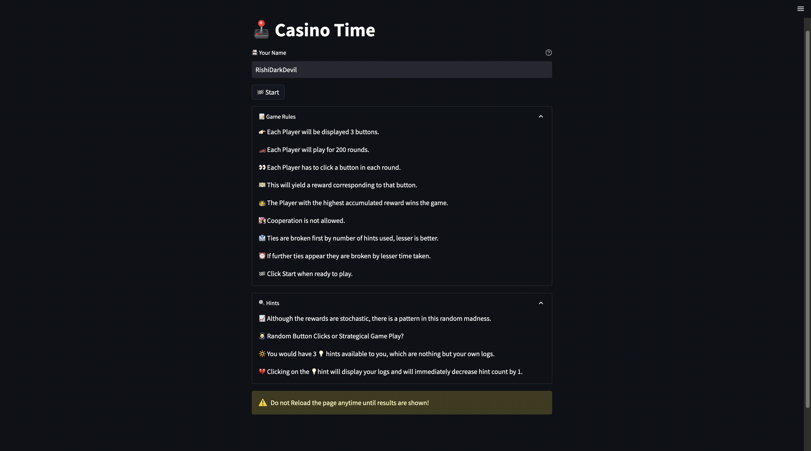
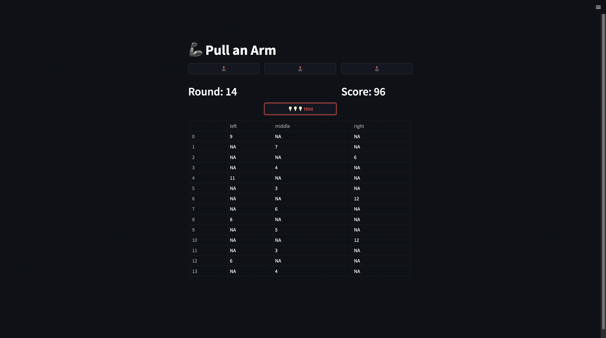
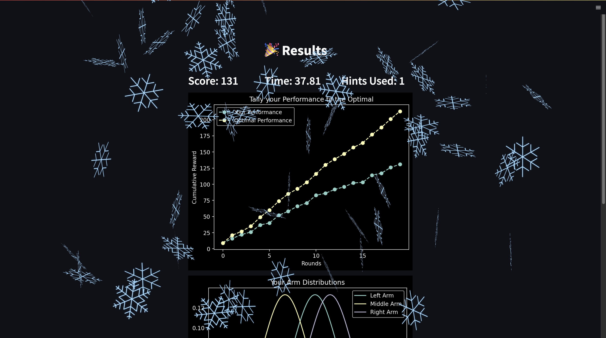
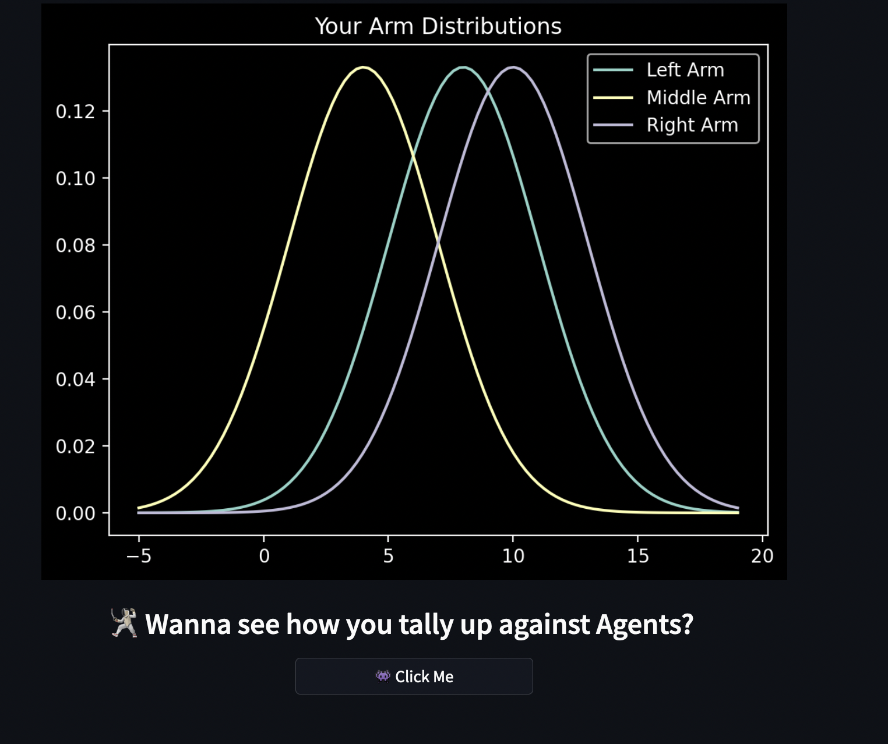
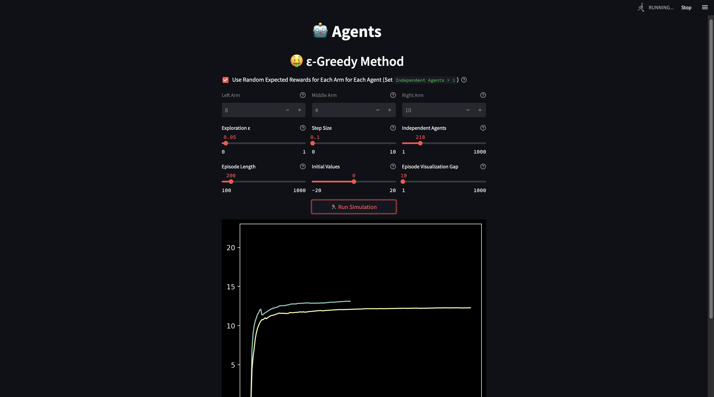

# Markov Decision Processes: Multi Armed Bandit
This is a Multi-Armed Bandit Web App on Streamlit. This app was a part of my [Talk on Markov Decision Processes](https://docs.google.com/presentation/d/e/2PACX-1vRD31VFnXp7ni_sY67V75UOx7hs-fQ402Z-NavxEeHU6miS5LnGwCOnv0FkzfHSQfDQUS5nn991nlxn/pub?start=false&loop=false&delayms=3000).

### Game Screenshots
Intro|Game Play (when hint is clicked)
-|-
|
Results (Optimal vs Player)| Results (Reveal Button Rewards)
|

### Epsilon Greedy Simulation


## Features
- A Nice Intro Page with introduction and hints
- Three-Armed Bandit Implementation which the player can try out on his own. 
- A fully functional Results page with comparison to the Optimal Performance and Arm's Reward Dynamics.
- Epsilon Greedy Agent Implementation on a 3-Arm Testbed (or user chosen Arm Reward Distributions)

## Usage
To run the WebApp, follow the instructions below,
```console
# Clone Repo
git clone https://github.com/RishiDarkDevil/MDP-Multi-Armed-Bandit.git
cd MDP-Multi-Armed-Bandit

# Install Prerequitesites
pip install streamlit numpy pandas matplotlib scipy

# Run WebApp
streamlit run MAB.py
```
**Note**: For the Agents Page, after running the simulation if you want to change the parameters and run again, as of now first stop the running on the top right corner of streamlit and then set the parameters and run again (Needs to be fixed).

## Upcoming
- Host the Application, with a Leaderboard.
- Allow the Host to change the Arm Dynamics which is currently hard-coded.
- Make it more interesting with changing Reward Distribution (But not too complicated as humans will play)
- Generalize to K-Arms.
